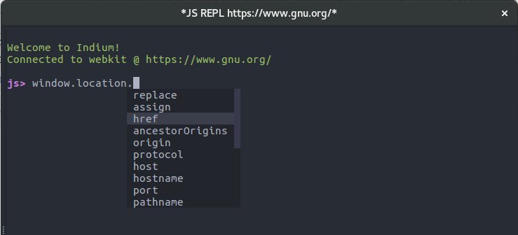
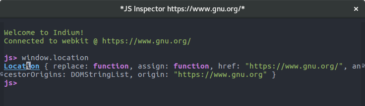
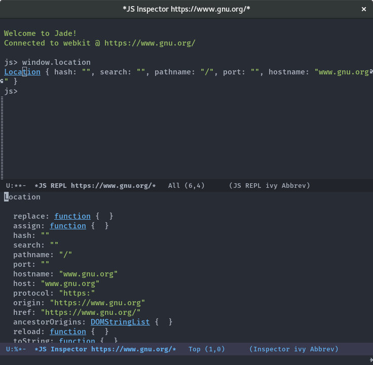

# Indium

A JavaScript development environment for Emacs.

Indium connects to a browser tab or nodejs process and provides many features for
JavaScript development, including:

- a REPL (with auto completion) & object inspection;
- an inspector, with history and navigation;
- a scratch buffer (`M-x indium-scratch`);
- JavaScript evaluation in JS buffers with `indium-interaction-mode`;
- a stepping Debugger, similar to `edebug`, or `cider`.

## Documentation

Installation instruction and other documentation can be found on
[readthedocs](https://indium.readthedocs.io).

**WARNING**: Indium 2.0 now uses a client/server architecture, see [installation
instuctions](https://indium.readthedocs.io/en/latest/installation.html).

## Screenshots

The stepping debugger

The REPL with company-mode

The REPL showing clickable output

The inspector

## Missing features

Indium is young, here's a list of missing/wanted features

- ~~Code evaluation using `C-x C-e` from project JS buffers~~
- ~~Adding breakpoints (to remove the need for `debugger` statements)~~
- Network inspector (could get inspiration from restclient.el)
- DOM inspector
- ~~Start processes (chromium, node, grunt, gulp, etc.) from Emacs and attach a
  indium connection to it.~~

## Backends

There is currently support for Chrom[e|ium] & nodejs.  The firefox backend is
in the TODO list.

